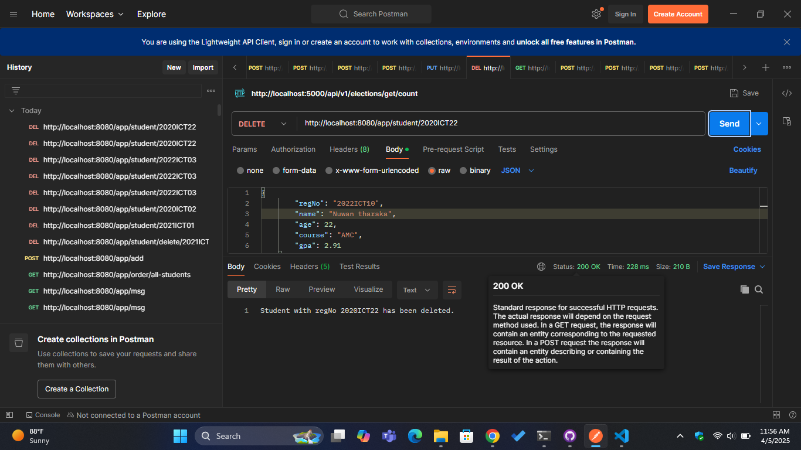
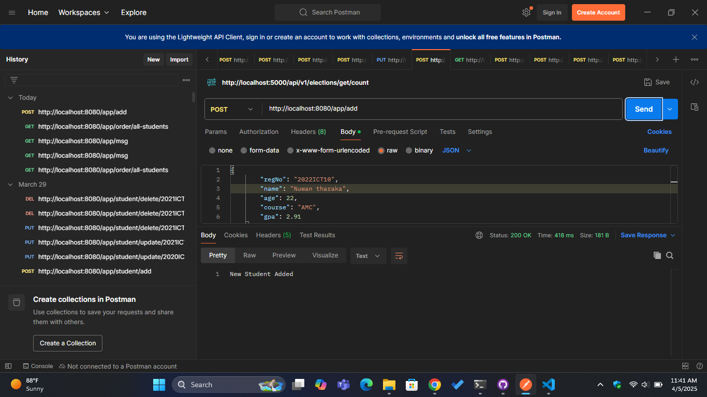
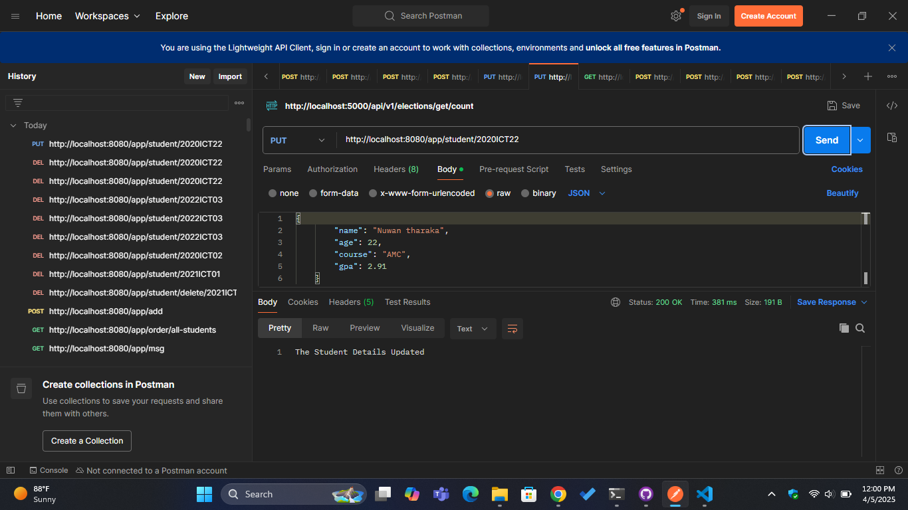
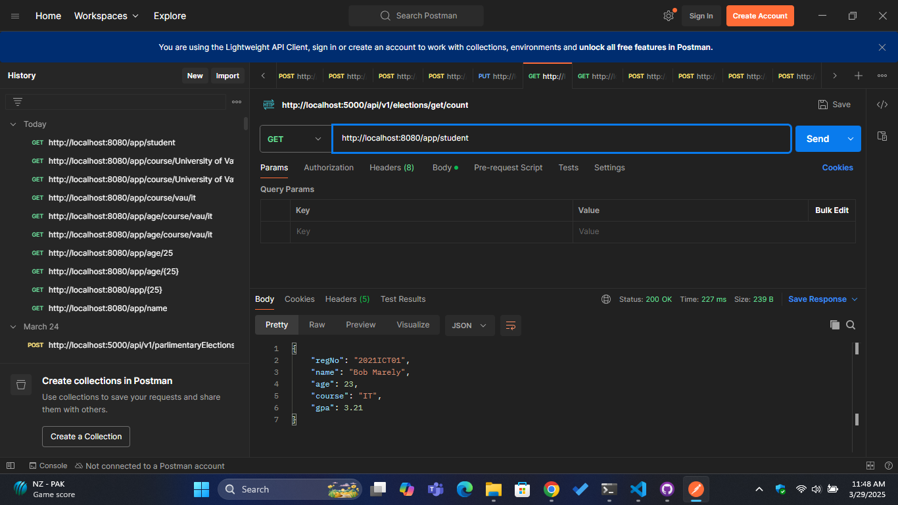
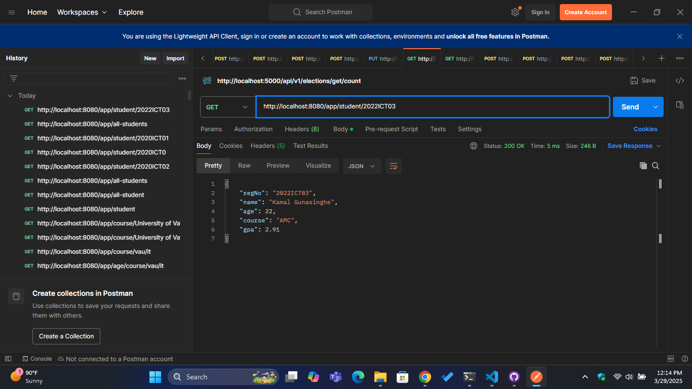
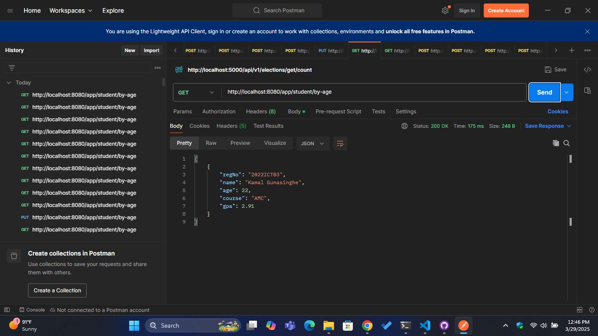
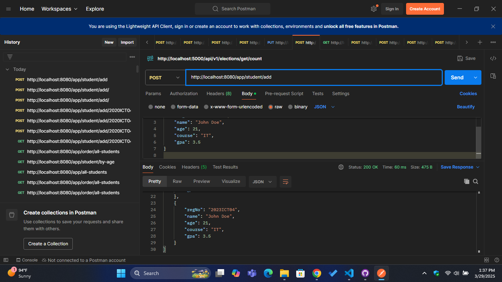
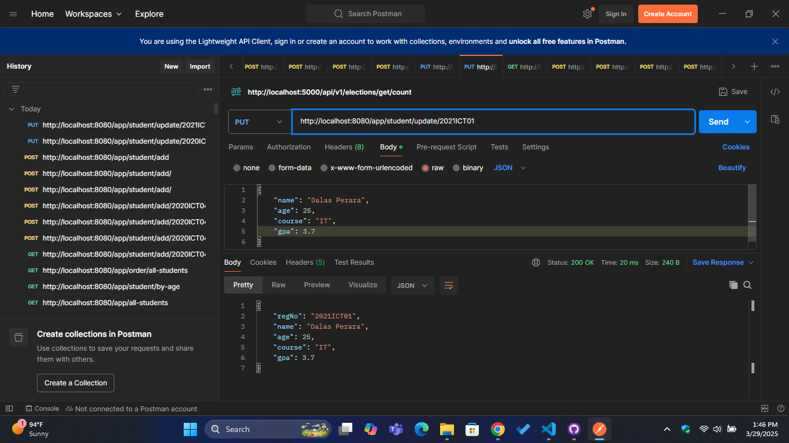
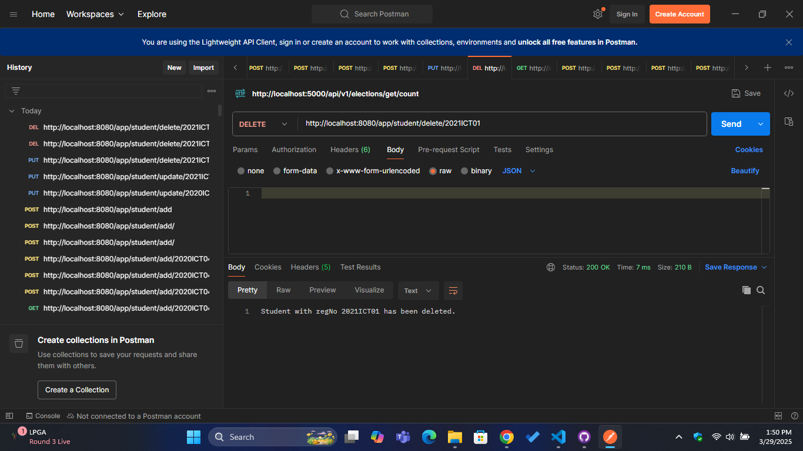

# First Spring Boot Project 🚀

This is my first project using Spring Boot. The main objective of this repository is to establish a Spring Boot application, explore its foundational structure, and develop a simple Student Management API. The project demonstrates how to implement basic CRUD operations for managing student data. Additionally, it provides a step-by-step guide for setting up a development environment in VS Code for Spring Boot development.

## 📌 Project Overview

- This project demonstrates how to create a basic Spring Boot application.
- It includes a simple controller (`AppController`) that defines various endpoints for student management.
- The application supports CRUD operations for students, such as adding, updating, retrieving, and deleting students.
- Helps others learn how to set up VS Code for Spring Boot projects.

### Features:
1. **GET /app/student** - Returns a single hardcoded student (Bob).
2. **GET /app/all-students** - Returns a list of all students.
3. **GET /app/student/{regno}** - Returns a student by their registration number.
4. **GET /app/student/by-age** - Returns students whose age is between 20 and 23.
5. **GET /app/order/all-students** - Returns all students sorted by GPA in descending order.
6. **POST /app/student/add** - Adds a new student.
7. **PUT /app/student/update/{regno}** - Updates an existing student's information by registration number.
8. **DELETE /app/student/delete/{regno}** - Deletes a student by registration number.

## 🛠️ Technologies Used

- **Spring Boot**
- **Java**
- **VS Code**
- **Maven** for build automation

## 📂 Project Structure

```text
src/
├── main/
│   ├── java/lk/ac/vau/fas/ict/first/Controller/AppController.java  # Main controller with all endpoints
│   ├── java/lk/ac/vau/fas/ict/first/Model/Student.java           # Model class for student data
│   ├── resources/
│   │   ├── application.properties
├── pom.xml                                                       # Maven project configuration file
├── README.md                                                     # Project documentation
```

## 🚀 How to Run the Project

1. **Clone the Repository**
   ```sh
   git clone https://github.com/LayuruLK/IT3232---SpringBoot-First-Project
   cd first-springboot-project
   ```

2. **Open the Project in VS Code**

   - Install the **Spring Boot Extension Pack** from the VS Code Marketplace.
   - Ensure you have **Java** and **Maven** installed.

3. **Run the Application**
   ```sh
   mvn spring-boot:run
   ```

4. **Access the Endpoints**
   Open your browser and visit the following endpoints:

   - [http://localhost:8080/app/msg](http://localhost:8080/app/msg) → Displays **"Hello SpringBoot"**
   - [http://localhost:8080/app/name](http://localhost:8080/app/name) → Displays **"My name is SpringBoot"**
   - [http://localhost:8080/app/student](http://localhost:8080/app/student) → Returns the student Bob
   - [http://localhost:8080/app/all-students](http://localhost:8080/app/all-students) → Returns all students
   - [http://localhost:8080/app/student/{regno}](http://localhost:8080/app/student/{regno}) → Returns a student by their registration number
   - [http://localhost:8080/app/student/by-age](http://localhost:8080/app/student/by-age) → Returns students between the age of 20 and 23
   - [http://localhost:8080/app/order/all-students](http://localhost:8080/app/order/all-students) → Returns students sorted by GPA
   - [http://localhost:8080/app/student/delete/{regno}](http://localhost:8080/app/student/delete/{regno}) → Delete student by Registration number
   - [http://localhost:8080/app/student/update/{regno}](http://localhost:8080/app/student/update/{regno}) → Update student by Registration number
   - [http://localhost:8080/app/student/add](http://localhost:8080/app/student/add) → Add New Student

## 📸 Output Screenshots

### 1️⃣ Message Endpoint (/app/msg)
  
### 2️⃣ Name Endpoint (/app/name)
  
### 3️⃣ Display Age (/app/age)
  
### 4️⃣ Multi-variable Passing Endpoint (/app/course/{uni}/{crs})
  
### 5️⃣ Get Student Endpoint (/app/student)
  
### 6️⃣ Get All Students Endpoint (/app/all-students)
  
### 7️⃣ Get Student by Registration Number (/app/student/{regno})
  
### 8️⃣ Get Student by Age (/app/student/by-age)
  
### 9️⃣ Get All Students by Order of GPA (/app/order/all-students)
  
### 🔟 Add New Student (/app/student/add)
  
### 1️⃣1️⃣ Update Existing Student by Registration Number (/app/student/update/{regno})
  
### 1️⃣2️⃣ Delete Student by Registration Number (/app/student/delete/{regno})
  

## 📌 Conclusion

This project serves as an excellent foundation for anyone getting started with Spring Boot. It provides a clear and hands-on approach to understanding key concepts such as setting up a Spring Boot application, creating RESTful APIs, and performing basic CRUD (Create, Read, Update, Delete) operations. With a simple student database, this project demonstrates how to manage data, handle HTTP requests, and implement dynamic endpoints. Whether you're new to Spring Boot or looking to reinforce your skills, this project offers valuable insights into building efficient, maintainable backend applications.


## 📜 License

***This project is open-source and available for learning purposes.***
