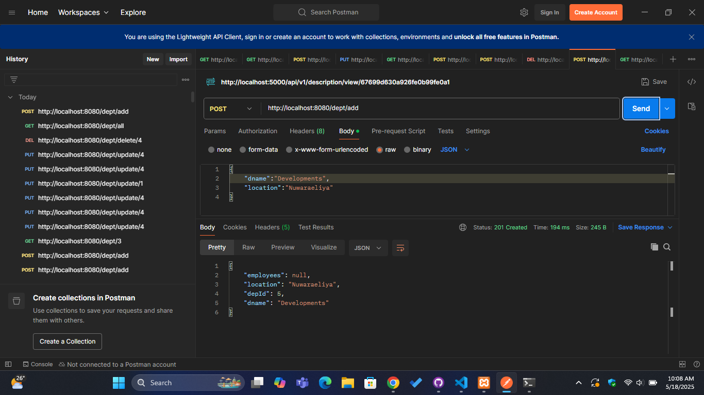
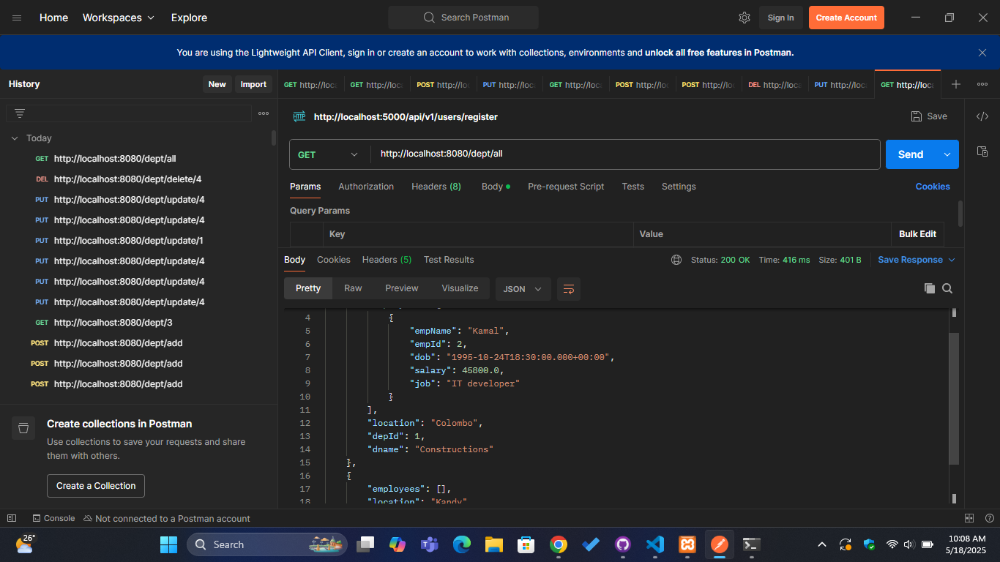
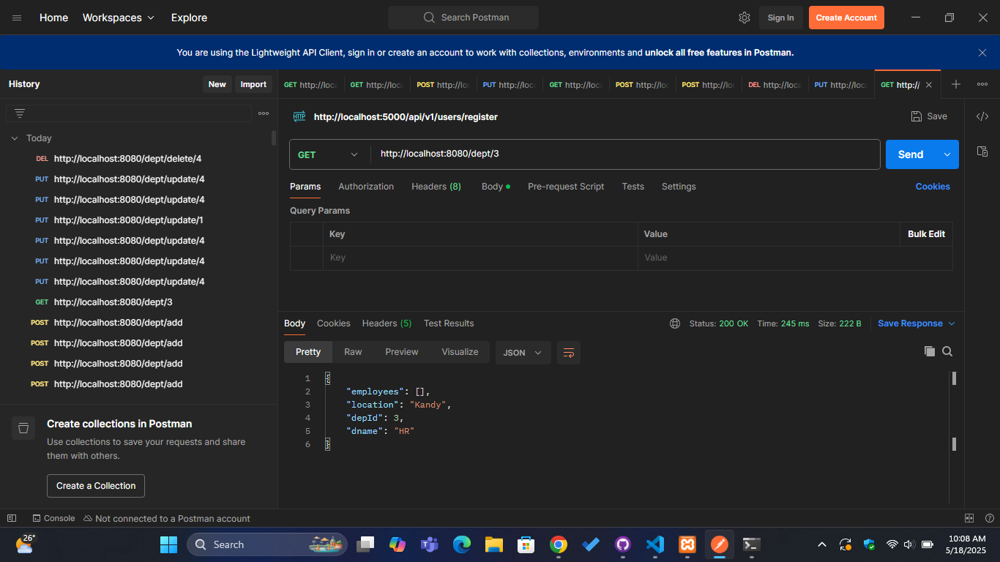
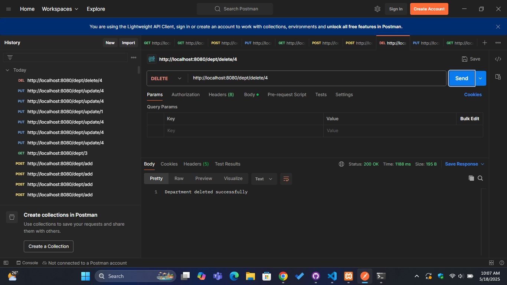

Here is a complete, professional, and well-structured `README.md` file in Markdown syntax tailored to your Spring Boot Department Management project. It includes project description, technologies used, setup guide, API documentation, screenshots, and more:

---

```markdown
# 🏢 Department Management System (Spring Boot + JPA)

This is a simple **Department Management System** built using **Spring Boot** and **Spring Data JPA**. The application manages departments and their associated employees, providing RESTful APIs to perform **CRUD operations** on departments.

It follows a clean **MVC architecture**, separating concerns across **Models**, **Repositories**, **Services**, and **Controllers**.

---

## 📌 Features

- Add, update, delete, and view departments
- Each department can contain multiple employees (One-To-Many relationship)
- Structured and layered Spring Boot project
- JPA for ORM with PostgreSQL/MySQL/H2 compatibility
- JSON serialization/deserialization with proper reference handling

---

## 🛠️ Technologies Used

- **Java 17+**
- **Spring Boot**
- **Spring Data JPA**
- **Hibernate**
- **Jackson (for JSON handling)**
- **Maven**
- **MySQL/PostgreSQL/H2 (you can configure any)**

---

## 📁 Project Structure

```

src/
├── controller/
│   └── DepartmentController.java
├── model/
│   ├── Department.java
│   └── Employee.java
├── repo/
│   └── DepartmentRepo.java
├── service/
│   └── DepartmentService.java
└── Application.java

````

---

## 🚀 Getting Started

### 1. Clone the repository

```bash
git clone https://github.com/your-username/department-management-system.git
cd department-management-system
````

### 2. Configure `application.properties`

Update your `src/main/resources/application.properties` with your database settings:

```properties
spring.datasource.url=jdbc:mysql://localhost:3306/your_db
spring.datasource.username=root
spring.datasource.password=your_password
spring.jpa.hibernate.ddl-auto=update
spring.jpa.show-sql=true
```

### 3. Run the application

```bash
./mvnw spring-boot:run
```

App will run on: `http://localhost:8080`

---

## 📡 API Endpoints

| Method | Endpoint               | Description                |
| ------ | ---------------------- | -------------------------- |
| GET    | `/dept/all`            | Get all departments        |
| GET    | `/dept/{depId}`        | Get department by ID       |
| POST   | `/dept/add`            | Add a new department       |
| PUT    | `/dept/update/{depId}` | Update existing department |
| DELETE | `/dept/delete/{depId}` | Delete department by ID    |

---

## 📸 Screenshots

| Action              | Image                                 |
| ------------------- | ------------------------------------- |
| Add Department      |            |
| Get All Departments |     |
| Get By ID           |  |
| Update Department   |      |
| Delete Department   |      |

---

## 🧠 Data Relationships

* A **Department** has multiple **Employees**
* Mapped using `@OneToMany` and `@ManyToOne`
* JSON references managed via `@JsonManagedReference` and `@JsonBackReference` to avoid infinite loops

---

## 🗂️ Future Improvements

* Add full CRUD for `Employee` entity
* Integrate Swagger UI for API documentation
* Add pagination and filtering
* Add authentication & authorization

---

## 🧑‍💻 Author

**Your Name**
📧 [your.email@example.com](mailto:your.email@example.com)
🔗 [LinkedIn](https://linkedin.com/in/yourprofile) | [GitHub](https://github.com/yourusername)

---

## 📄 License

This project is licensed under the MIT License. See the [LICENSE](LICENSE) file for details.

```

---

Let me know if you want this adapted for Swagger UI, Docker, employee controller integration, or a specific database setup. I can also write a `LICENSE` file and `application.properties` if needed.
```
