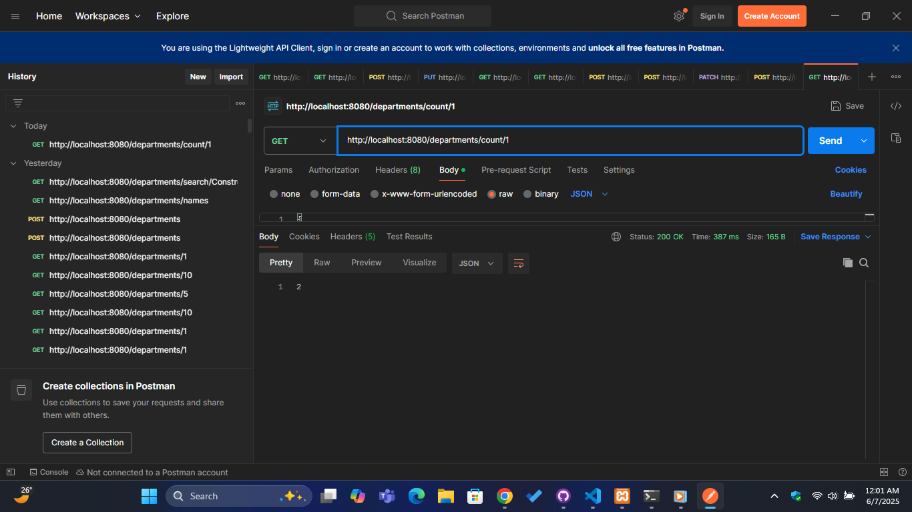
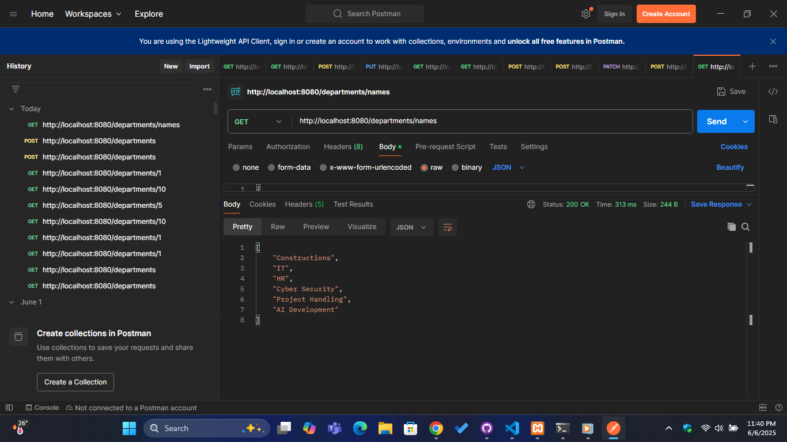
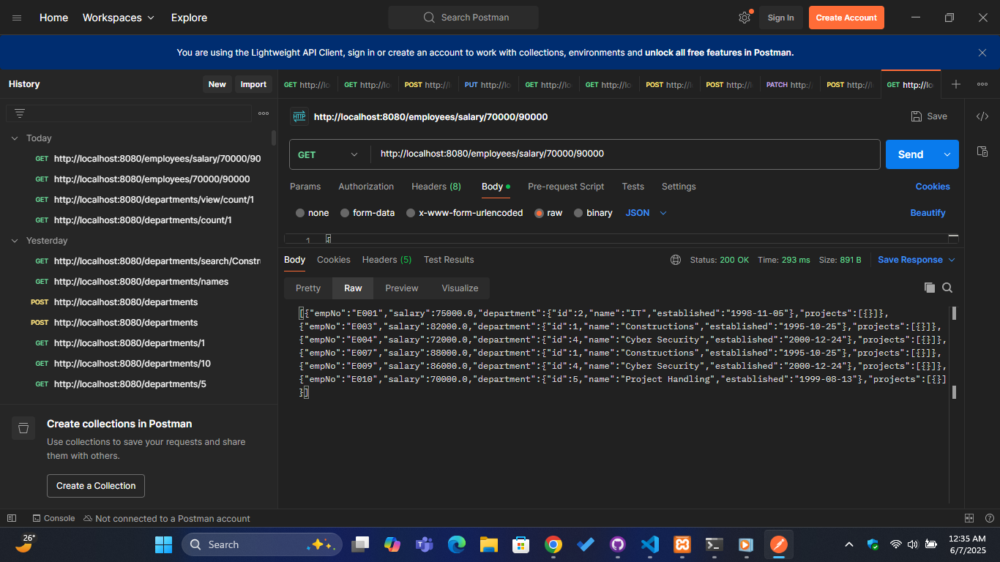
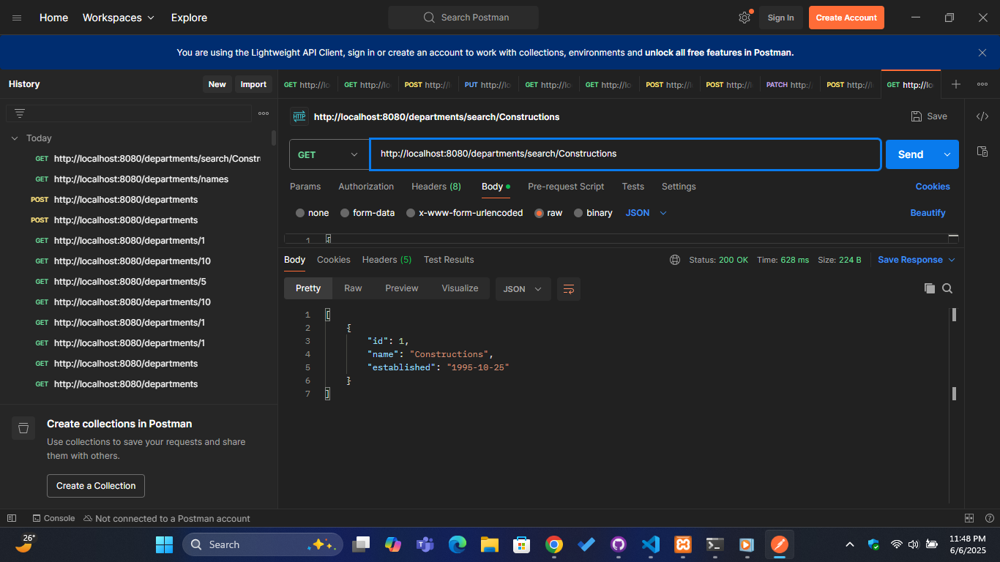
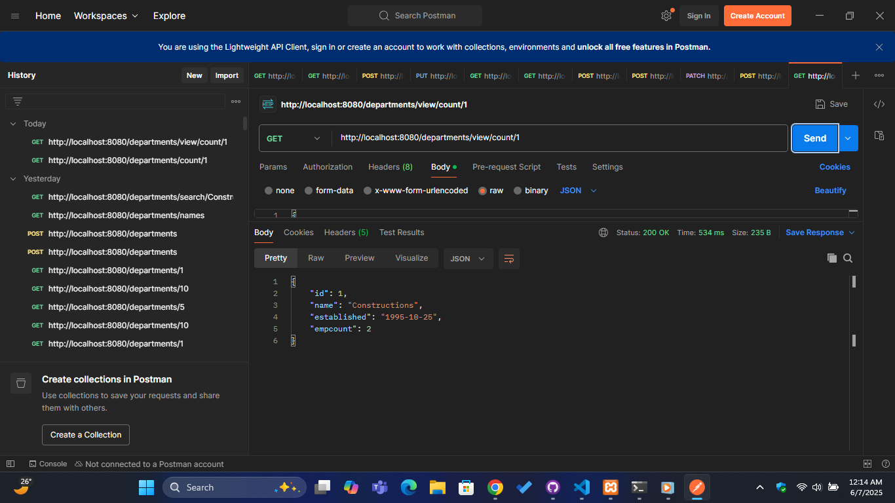

# Department & Employee Management System (Day 11)

This project is a Spring Boot-based RESTful API demonstrating the use of **JPQL queries**, **Spring Data JPA repositories**, and layered architecture with **services** and **controllers**. It focuses on managing departments and employees within a company database named `company`.

---

## Table of Contents

- [Project Overview](#project-overview)
- [Technologies Used](#technologies-used)
- [Features](#features)
- [Project Structure](#project-structure)
- [Usage](#usage)
- [Sample API Endpoints & Screenshots](#sample-api-endpoints--screenshots)
- [How to Run](#how-to-run)
- [Contact](#contact)
- [Repository Link](#repository-link)

---

## Project Overview

This system models a company's organizational structure with entities such as **Department**, **Employee**, and **Project**. It uses JPQL queries to fetch specific data like department names, employee counts, employees within a salary range, and departments searched by name.

Key highlights:
- Custom JPQL queries in repositories for efficient data retrieval.
- Exception handling via Spring exceptions like `EntityNotFoundException` and `DuplicateKeyException`.
- Layered architecture: Controllers → Services → Repositories → Database.
- JSON responses suitable for integration with frontend applications.

---

## Technologies Used

- Java 17+
- Spring Boot 3.x
- Spring Data JPA (Hibernate)
- Jakarta Persistence API (JPA)
- Maven
- H2 / MySQL (assumed for `company` database)
- Jackson (for JSON serialization)
- Lombok (optional in this project, but can be added for boilerplate reduction)

---

## Features

- Retrieve all departments and individual department details.
- Add new departments with duplicate ID check.
- Search departments by partial name.
- Get a list of all department names.
- Get the count of employees in a department.
- Get detailed department info along with employee count.
- Find employees within a salary range.
- Clean RESTful API with HTTP status codes.
- JPQL queries to optimize data retrieval.

---

## Project Structure

```

lk.vau.fas.day.eleven
│
├── model
│   ├── Department.java
│   ├── Employee.java
│   ├── Project.java
│   ├── Person.java (MappedSuperclass)
│   ├── ViewDepartment.java (Department extended with employee count)
│   └── ErrorResponce.java (Error message structure)
│
├── repository
│   ├── DepartmentRepository.java (JPQL queries for departments)
│   └── EmployeeRepository.java (JPQL queries for employees)
│
├── service
│   ├── DepartmentService.java (Business logic, exception handling)
│   └── EmployeeService.java
│
└── controller
├── DepartmentController.java (REST endpoints for departments)
└── EmployeeController.java (REST endpoints for employees)

````

---

## Usage

### Department APIs

| Endpoint                       | Method | Description                                |
|-------------------------------|--------|--------------------------------------------|
| `/departments`                 | GET    | Get all departments                        |
| `/departments/{id}`            | GET    | Get department by ID                       |
| `/departments`                 | POST   | Add new department                         |
| `/departments/names`           | GET    | Get all department names                   |
| `/departments/search/{name}`   | GET    | Search departments by name (partial match)|
| `/departments/count/{dept_id}` | GET    | Get employee count in department           |
| `/departments/view/count/{id}` | GET    | Get department details with employee count|

### Employee APIs

| Endpoint                    | Method | Description                          |
|----------------------------|--------|------------------------------------|
| `/employees/salary/{a}/{b}` | GET    | Find employees with salary between `a` and `b` |

---

## Sample API Endpoints & Screenshots

### 1. Get Employee Count in Department

`GET /departments/count/{dept_id}`



---

### 2. Get Department Names

`GET /departments/names`



---

### 3. Find Employees Within Salary Range

`GET /employees/salary/{a}/{b}` (Example: 70000 to 90000)



---

### 4. Search Departments by Name (Partial Match)

`GET /departments/search/{name}`



---

### 5. View Department with Employee Count

`GET /departments/view/count/{id}`



---

## How to Run

1. **Clone the repository**
   ```bash
   git clone https://github.com/LayuruLK/IT3232-E-commerce_Class-Works.git
   cd IT3232-E-commerce_Class-Works/Day\ 11/eleven
````

2. **Configure database connection**

   Update your `application.properties` (or `application.yml`) with your `company` database credentials:

   ```properties
   spring.datasource.url=jdbc:mysql://localhost:3306/company
   spring.datasource.username=your_db_username
   spring.datasource.password=your_db_password
   spring.jpa.hibernate.ddl-auto=update
   spring.jpa.show-sql=true
   ```

3. **Build and run the project**

   ```bash
   mvn clean install
   mvn spring-boot:run
   ```

4. **Access endpoints**

   Use Postman or any REST client to test the APIs.

---

## Contact

* **Email:** [layurulakvidukarunathilaka@gmail.com](mailto:layurulakvidukarunathilaka@gmail.com)
* **LinkedIn:** [Layuru K](https://www.linkedin.com/in/layuru-k-02b345245)

---

## Repository Link

[https://github.com/LayuruLK/IT3232-E-commerce\_Class-Works/tree/main/Day%2011/eleven](https://github.com/LayuruLK/IT3232-E-commerce_Class-Works/tree/main/Day%2011/eleven)

---

*This project was developed as part of the IT3232 course exercises, focusing on JPQL, Spring Data JPA, and REST API development with exception handling.*