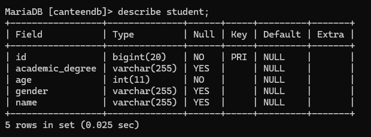
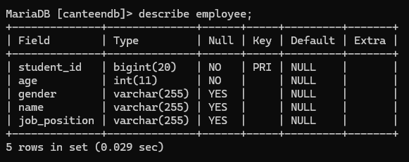
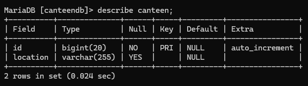
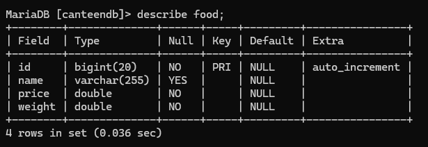
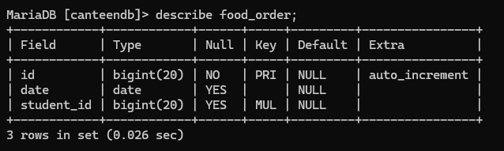
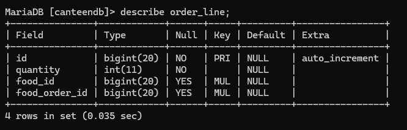
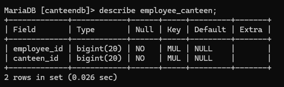
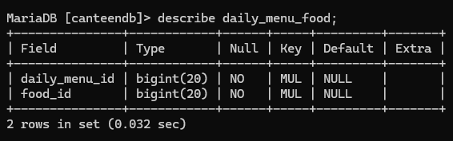

# 🍽️ Smart Canteen Management System – Spring Boot Project

**University of Vavuniya**  
Faculty of Applied Science – Department of Physical Science  
📘 **Module:** IT 3232 – Practical for E-Commerce  
📝 **Assignment:** ICAE 01  
🗓️ **Date:** 2nd May 2025  

---

## 📌 Project Overview

This project is a **Smart Canteen Management System** developed using **Spring Boot** with JPA/Hibernate ORM. The system is designed to manage multiple canteens across the university campus, each with a dynamic daily menu, and it allows both students and employees to interact with the system in different ways.

The system is capable of:
- Managing students and employees
- Associating employees with multiple canteens
- Creating daily menus for each canteen
- Enabling students to place food orders
- Storing detailed order information with item-wise breakdown

---

## 💡 Key Requirements Implemented

- Proper class hierarchy using inheritance (`Student` and `Employee` from `Person`)
- Many-to-many, one-to-many, and many-to-one relationships via JPA
- Database schema auto-generated using Hibernate ORM
- Data backup and table inspection using SQL `DESCRIBE`

---

## 🧰 Technology Stack

| Technology        | Purpose                          |
|------------------|----------------------------------|
| Java 17+         | Programming Language              |
| Spring Boot 3.x  | Backend Framework                 |
| JPA/Hibernate    | ORM for Entity Mapping            |
| MySQL / H2       | Relational Database               |
| Maven            | Build & Dependency Management     |
| IntelliJ / VSCode| IDE (Any)                         |

---

## 🏗️ Entity Structure and Relationships

### 🔸 Person (Abstract Superclass)
- Fields: `id`, `name`, `age`, `gender`
- Inherited by: `Student`, `Employee`

---

### 🔸 Student
- Extra Field: `academicDegree`
- Relationships:
  - `@OneToMany` with `FoodOrder`

---

### 🔸 Employee
- Extra Field: `jobPosition`
- Relationships:
  - `@ManyToMany` with `Canteen`

---

### 🔸 Canteen
- Fields: `id`, `location`
- Relationships:
  - `@OneToMany` with `DailyMenu`
  - `@ManyToMany` with `Employee`

---

### 🔸 Food
- Fields: `name`, `price`, `weight`
- Relationships:
  - `@ManyToMany` with `DailyMenu`
  - `@OneToMany` with `OrderLine`

---

### 🔸 DailyMenu
- Fields: `id`, `date`
- Relationships:
  - `@ManyToOne` with `Canteen`
  - `@ManyToMany` with `Food`

---

### 🔸 FoodOrder
- Fields: `id`, `date`
- Relationships:
  - `@ManyToOne` with `Student`
  - `@OneToMany` with `OrderLine`

---

### 🔸 OrderLine
- Fields: `id`, `quantity`
- Relationships:
  - `@ManyToOne` with `Food`
  - `@ManyToOne` with `FoodOrder`

---

## ⚙️ Setup Instructions

1. Clone the repository into your Spring Boot project.
2. Add all model classes into your `model` package.
3. Set up your `application.properties`:

```properties
spring.datasource.url=jdbc:mysql://localhost:3306/canteen_db
spring.datasource.username=root
spring.datasource.password=yourpassword
spring.jpa.hibernate.ddl-auto=update
spring.jpa.show-sql=true
spring.jpa.properties.hibernate.dialect=org.hibernate.dialect.MySQL8Dialect
````

4. Run the application to auto-generate the database.
5. Use a tool like MySQL Workbench or phpMyAdmin to inspect tables.
6. Execute `DESCRIBE table_name;` for each table.

---

## 📸 Table Descriptions (Screenshots)

> ⚠️ Replace the image paths below with actual screenshots you take from your SQL tool (e.g., MySQL Workbench).

### 🔹 Student Table



---

### 🔹 Employee Table



---

### 🔹 Canteen Table



---

### 🔹 Food Table



---

### 🔹 DailyMenu Table


---

### 🔹 FoodOrder Table



---

### 🔹 OrderLine Table



---

### 🔹 employee\_canteen Join Table



---

### 🔹 daily\_menu\_food Join Table



---

## 🗂️ Submission Instructions

After completing the project:

* Copy only the `model` folder and the **generated database backup** to the `Z` drive.
* Do **not** copy files that are still open in the IDE.
* Confirm that all relationships are correctly reflected in the generated schema.

---

## 📬 Contact

For any clarification, contact the instructor or teaching assistant through official university channels.

---

