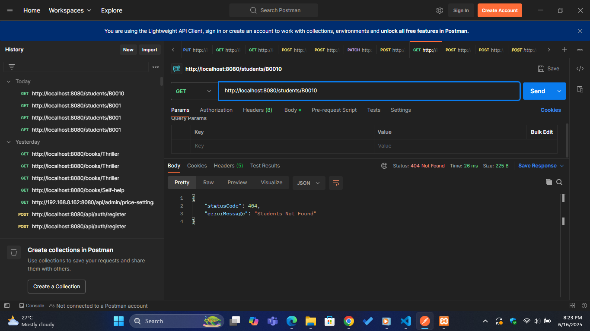

# 📚 Library Management System - RESTful API with Spring Boot

> **Assignment:** Practical for E-Commerce (ICAE 02)  
> **Module Code:** IT 3232  
> **Faculty:** Applied Science, University of Vavuniya  
> **Date:** 13th June 2025  

---

## 📌 Overview

This project is a **Spring Boot-based RESTful API** for a **Library Management System**, developed to fulfill the ICAE 02 practical examination. It simulates basic functionality required for managing students, books, and borrowing processes within a library. 

It demonstrates:
- Data modeling with JPA & Hibernate.
- Data validation.
- Custom error handling.
- RESTful APIs with Spring Boot.
- Integration with MySQL.

---

## 📁 Project Structure

```text
src/
 ├── models/
 │    ├── Book.java
 │    ├── Student.java
 │    ├── Borrow.java
 │    └── ErrorResponce.java
 ├── repository/
 │    ├── BookRepository.java
 │    ├── StudentRepository.java
 │    └── BorrowRepository.java
 ├── service/
 │    ├── BookService.java
 │    ├── StudentService.java
 │    └── BorrowService.java
 ├── controllers/
 │    ├── BookController.java
 │    ├── StudentController.java
 │    └── BorrowController.java
 └── exceptionHandler/
      └── GenericExceptionHandler.java
````

---

## 🧩 Models

* `Book`: Stores book information including genre, copies, title, etc.
* `Student`: Contains student information.
* `Borrow`: Manages borrow entries including borrow date, return date, and borrow status.
* `ErrorResponce`: Wrapper class for error handling.

---

## ✅ Tasks Implementation

### 🔹 Task 1: Map Models and Insert Data

All models are annotated with `@Entity` and mapped using JPA annotations. Data can be inserted using SQL or by using MySQL Workbench.

✅ **Sample MySQL CMD Screenshot:**


---

### 🔹 Task 2: Filter Books by Genre

```java
@Query("SELECT b from Book b WHERE b.genre=?1")
public List<Book> getByGenre(String genre);
```

API Endpoint:

```
GET /books/{genre}
```

✅ **Screenshot:**


---

### 🔹 Task 3: Find Students by Book ID

```java
@Query("SELECT s from Student s JOIN s.borrows b WHERE b.book.id=?1")
public List<Student> getBorrowedStudent(String bookId);
```

API Endpoint:

```
GET /students/{bookId}
```

✅ **Screenshot:**


---

### 🔹 Task 4: Book Borrowing Logic

#### 🔧 Original Implementation

Only partial validation implemented in `BorrowService`. Missing:

* Check for max 2 unreturned books.
* At least 1 non-lendable copy.
* Proper inventory update.

---

✅ **Screenshot - Success:**


✅ **Screenshot - Failure:**

* Book only one copy: `borrowEntryError.png`
* Too many unreturned books: `entityNotFound.png`

---

## 🧪 API Endpoints Summary

| Method | Endpoint             | Description                        |
| ------ | -------------------- | ---------------------------------- |
| GET    | `/books/{genre}`     | Get books by genre                 |
| GET    | `/students/{bookId}` | Get students who borrowed the book |
| POST   | `/borrows/add`       | Create new borrow entry            |

---

## 🚨 Error Handling

Handled by `GenericExceptionHandler` using:

* `@RestControllerAdvice`
* `@ExceptionHandler` for:

  * `EntityNotFoundException`
  * `DataIntegrityViolationException`
  * Generic `Exception`

✅ **Error Screenshot:**



---

## 🧷 How to Run the Project

1. Ensure **MySQL** is running and update `application.properties` with credentials.
2. Use **Spring Boot** runner (e.g., Eclipse, IntelliJ, or terminal).
3. Use tools like **Postman** to test endpoints.
4. Data is automatically mapped from models using Spring Data JPA.

---

## 📸 Screenshots

| Screenshot             | Description                        |
| ---------------------- | ---------------------------------- |
| `getByGenre.png`       | Filter books by genre              |
| `borrowedStudents.png` | View students who borrowed a book  |
| `newBorrowEntry.png`   | Successful book borrow             |
| `borrowEntryError.png` | Failure: too many unreturned books |
| `entityNotFound.png`   | Failure: student/book not found    |

---

## 📌 Final Notes

* ✅ Models are properly mapped to DB.
* ✅ Repository queries used for filtering and joins.
* ✅ Service layer handles all validations and business logic.
* ✅ All error cases are clearly handled.
* ✅ Project fulfills **all 4 tasks** from the assignment.

---

## 🧠 Author

Layuru Lakvidu – B.Sc. Undergraduate (IT)
Department of Physical Science, University of Vavuniya

---
